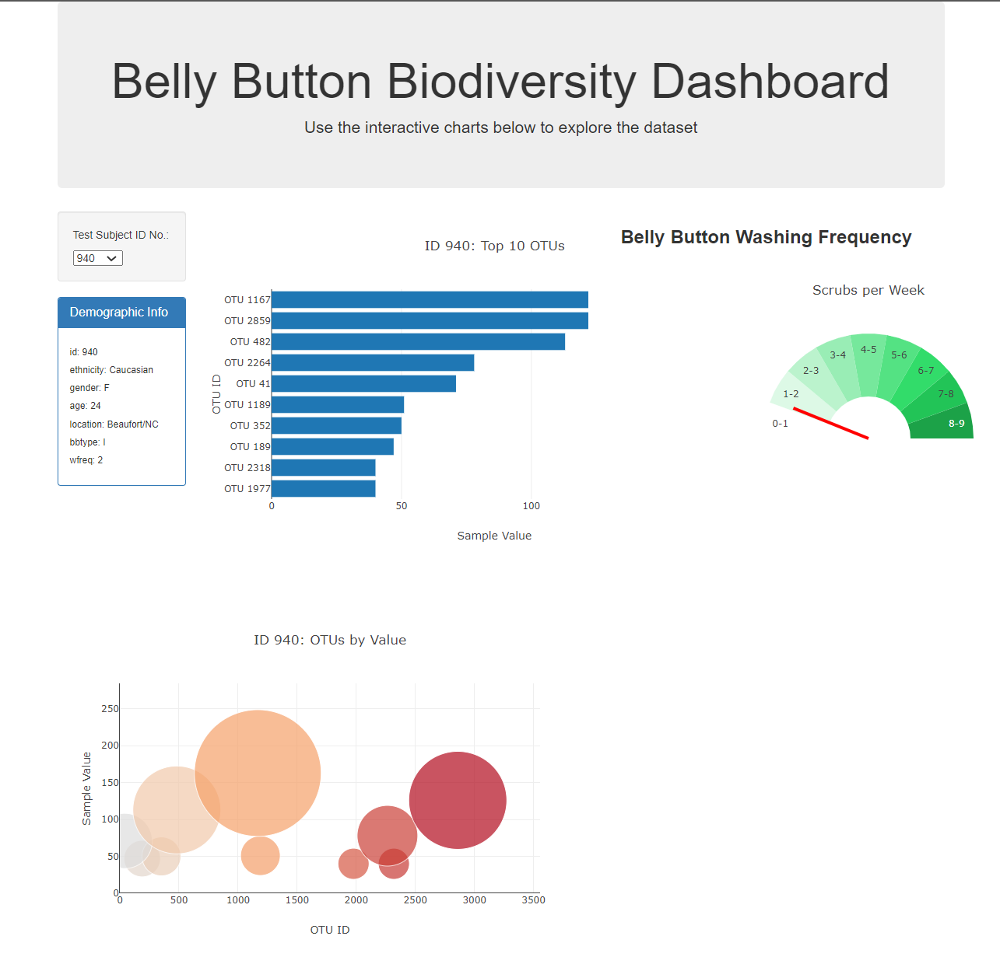
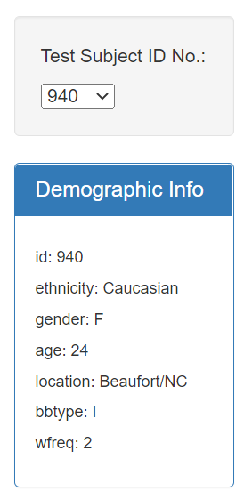
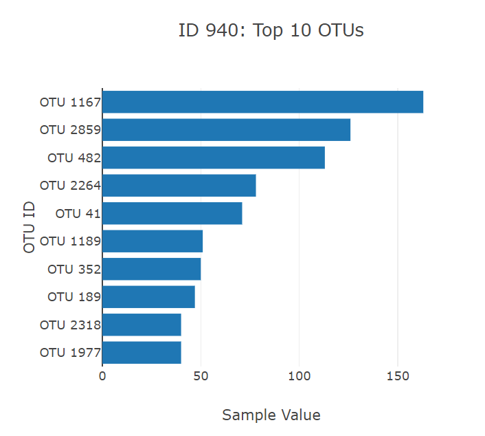
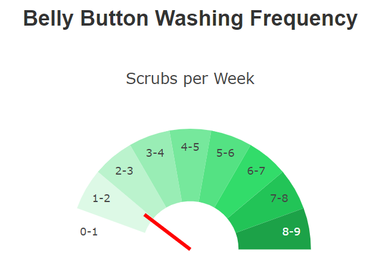
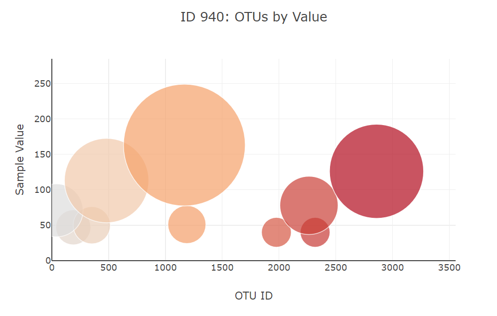

# Belly Button Biodiversity
From a datset of [belly button samples](data/samples.json) observing operation taxonomic units (OTUs) present in more than 70% of people, a dashboard was created. The dashboard displays a panel of the individual's demographic information, a bar chart of the top 10 OTUs present in an individual's sample, a gauge indicating the number of washes per week, and a weighted bubble chart of the OTUs present. A dropdown allows for toggling between individuals.

The website layout is described in [index.html](index.html), and the functions encoding each graph and panel in [plots.js](plots.js). The live website is located at [https://sbowe1.github.io/diversity-javascript/](https://sbowe1.github.io/diversity-javascript/).

## Dashboard

### Dropdown and Info Panel

The dropdown (set initially at number 940), allows a specific individual from the study to be chosen. If a new individual is chosen, the page refreshes each chart and the information panel. 

The information panel lists all demographic data obtained for the specified individual.

### Top 10 Bar Chart

The horizontal bar chart demonstrates the quantity of each of the top 10 OTUs present in a specific individual. The quantity and OTU's identites are displayed when a bar is hovered over.

### Wash Frequency Gauge

The gauge displays the number of times the individual washes their belly button in a week on a scale of 0-9, with the red needle pointing to the frequency. 

### OTU Bubble Chart

The bubble chart shows the number of samples found for each OTU in an individual. OTUs are distinguished by color, and the size of each bubble corresponds to the OTU's sample quantity. When hovered over, the bubble's sample quantity and OTU identites are revealed.